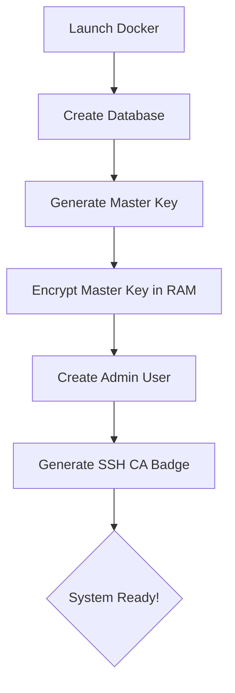

<div align="center">
  
  # SecureVault 🛡️
  **Created by Sandesha Wakchaure**
  
  *Your own high-security vault for passwords, keys, and server access.*
  
  [Quick Start](#-quick-start) • [How it Works](#-the-logic) • [Security Features](#-security-benefits)
</div>

---

### 🌟 Project Snapshot
SecureVault is like a digital fortress. It doesn't just store your passwords; it manages your entire server infrastructure's security automatically.

| Feature | What it does for you |
| :--- | :--- |
| **Secrets Safe** | Keeps your API keys and passwords locked behind AES-256 encryption. |
| **SSH Bouncer** | Issues "Visitor Badges" for your servers instead of permanent keys. |
| **Auto-Rotator** | Log in once, and the app changes your database passwords every week. |
| **Audit Trail** | An unchangeable diary of every single login and key access. |

---

### 🚀 Quick Start (Get running in 2 mins)

1. **Setup Environment**
   ```bash
   cp .env.example .env
   ```
   *Open `.env` and set your passwords.*

2. **Generate SSL (Security)**
   ```bash
   mkdir certs && openssl req -x509 -newkey rsa:4096 -keyout certs/server.key -out certs/server.crt -days 365 -nodes -subj "/CN=localhost"
   ```

3. **Launch the Vault**
   ```bash
   docker-compose up --build -d
   ```
   *Visit **https://localhost** and login as `admin`.*

---

### ⚙️ The "First Boot" Flow
When you run SecureVault for the first time, it performs a "handshake" to secure your hardware:



---

### 📂 Folder Structure (Simple View)
*   `backend/` - The "Brain" (Python/FastAPI)
*   `frontend/` - The "Face" (React/Vite)
*   `certs/` - The "SSL Gatekeeper"
*   `data/` - Where the encrypted database lives

---

### 🛠️ Configuration (The .env file)
| Variable | Why it matters |
| :--- | :--- |
| `SECUREVAULT_ADMIN_PASSWORD` | The password you'll use to log in. |
| `SECUREVAULT_ROOT_TOKEN` | The "Master Key" used to encrypt everything else. |
| `SECUREVAULT_JWT_SECRET` | Used to keep your browser session secure. |

---

### 📜 Security Guarantee
*   **Zero-Trust:** Every request is checked for a valid badge.
*   **In-Memory Only:** The master key is never saved to a file; it disappears if the server is unplugged.
*   **Encapsulated:** Runs entirely in isolated Docker containers.

---


