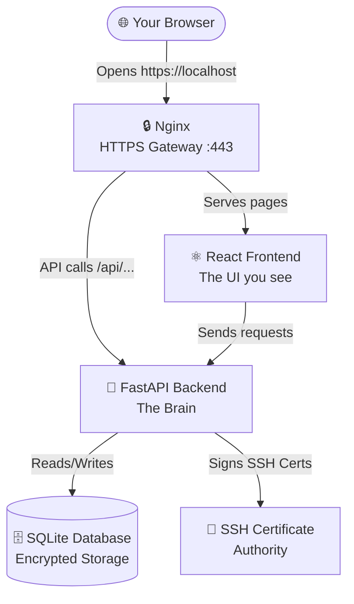
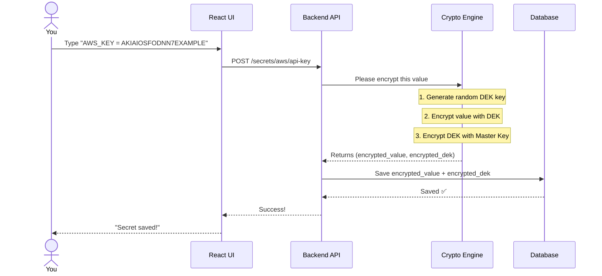
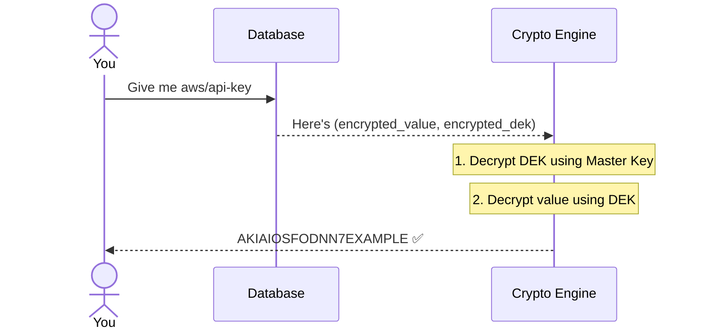
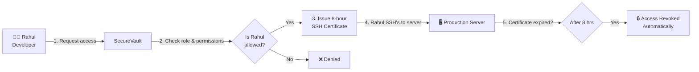
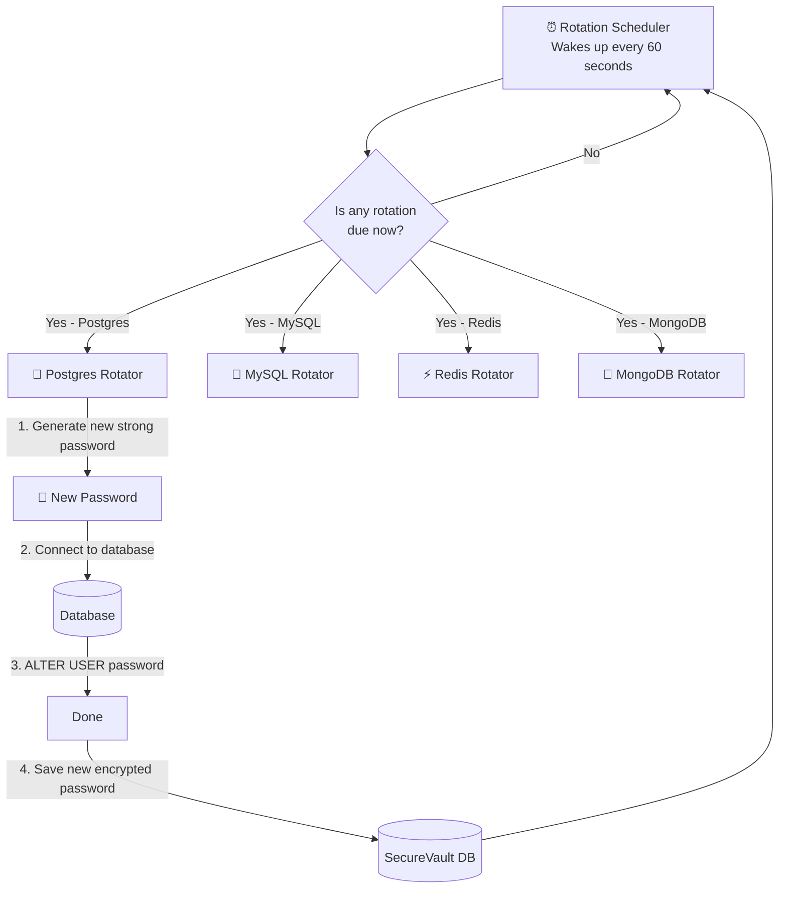
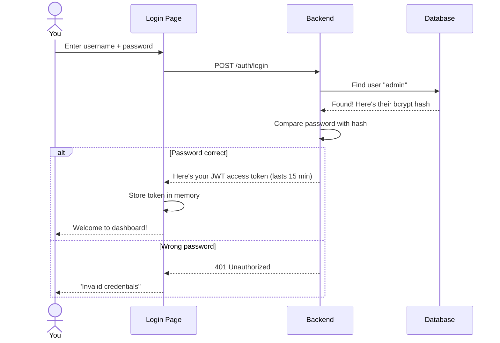
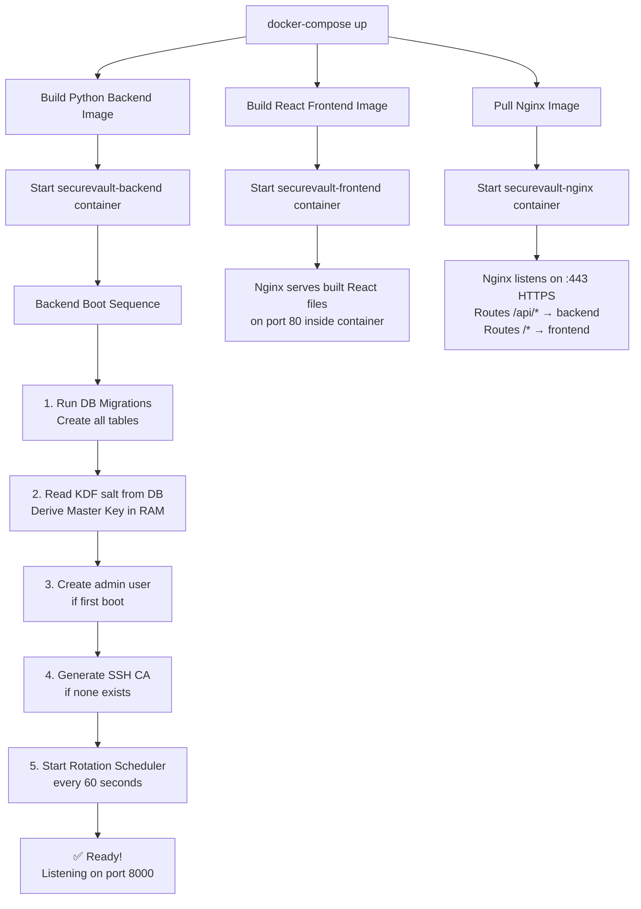

# 📚 SecureVault — Complete Study Guide
### By Rohit Patil | Understand everything from scratch

---

## 🧠 What Problem Does SecureVault Solve?

Imagine you run a company with 10 servers and 5 developers.

- Every developer needs SSH access to those servers
- Every server has a database with a password
- Every app has API keys (for payment, email, etc.)

**Without SecureVault:**
- Passwords are stored in emails, WhatsApp, sticky notes 😱
- SSH keys never expire — if someone quits, you need to manually remove access from all 10 servers
- Database passwords are never changed — a hacker who steals it has permanent access

**With SecureVault:**
- All secrets stored in one encrypted vault ✅
- SSH access expires after 8 hours automatically ✅
- Database passwords are auto-changed every week ✅

---

## 🏗️ The Big Picture — How It All Fits Together



**Think of it like a Bank:**
- 🌐 **Nginx** = The bank's security door
- ⚛️ **Frontend** = The ATM screen you interact with
- 🐍 **Backend** = The bank teller who actually does the work
- 🗄️ **Database** = The bank's safe/vault
- 🔑 **SSH CA** = The department that issues employee badges

---

## 📂 Complete Project Structure — Every File Explained

```
SecureVault/
│
├── 📄 docker-compose.yml      ← Starts all 3 containers together
├── 📄 .env                    ← Your secret passwords (never share this!)
├── 📄 .env.example            ← Template showing what .env needs
├── 📄 .gitignore              ← Tells Git to ignore .env, certs, etc.
├── 📄 nginx.conf              ← Nginx config: HTTPS setup, routing
│
├── 📁 certs/                  ← SSL certificates for HTTPS
│   ├── server.crt             ← Public certificate
│   └── server.key             ← Private key (keep secret!)
│
├── 📁 backend/                ← Python FastAPI Server
│   ├── 📄 main.py             ← App startup, first boot sequence
│   ├── 📄 config.py           ← Reads settings from .env file
│   ├── 📄 database.py         ← Creates/manages SQLite database
│   ├── 📄 requirements.txt    ← List of Python libraries needed
│   │
│   ├── 📁 api/                ← HTTP endpoints (what URLs you can call)
│   │   ├── auth.py            ← /auth/login, /auth/logout
│   │   ├── secrets.py         ← /secrets (store/read passwords)
│   │   ├── ssh.py             ← /ssh/sign (issue SSH certificates)
│   │   ├── rotation.py        ← /rotation (manage auto-rotation)
│   │   ├── rbac.py            ← /users, /roles (manage permissions)
│   │   └── audit.py           ← /audit/log (see who did what)
│   │
│   ├── 📁 auth/               ← Login & security logic
│   │   ├── jwt.py             ← Creates login tokens (like a ticket)
│   │   ├── totp.py            ← Google Authenticator (2FA) logic
│   │   ├── middleware.py      ← Checks if you're logged in
│   │   └── rbac.py            ← Checks if you have permission
│   │
│   ├── 📁 crypto/             ← Encryption logic
│   │   └── vault.py           ← AES-256-GCM encryption/decryption
│   │
│   ├── 📁 secrets/            ← Secret storage logic
│   │   ├── engine.py          ← Core: encrypt & save secrets
│   │   └── kv.py              ← Key-Value store interface
│   │
│   ├── 📁 ssh_ca/             ← SSH Certificate Authority
│   │   ├── ca.py              ← Generate CA, sign certificates, KRL
│   │   └── signer.py          ← Runs ssh-keygen subprocess
│   │
│   ├── 📁 rotation/           ← Auto-password rotation
│   │   ├── scheduler.py       ← Checks every 60s for due rotations
│   │   ├── postgres.py        ← Rotates PostgreSQL passwords
│   │   ├── mysql.py           ← Rotates MySQL passwords
│   │   ├── redis.py           ← Rotates Redis passwords
│   │   └── mongodb.py         ← Rotates MongoDB passwords
│   │
│   └── 📁 audit/              ← Activity logging
│       └── log.py             ← Writes activity to database
│
└── 📁 frontend/               ← React TypeScript UI
    └── 📁 src/
        ├── 📁 pages/          ← Full page screens
        │   ├── Login.tsx      ← Login screen
        │   ├── Dashboard.tsx  ← Home screen with stats
        │   ├── Secrets.tsx    ← Browse/manage secrets
        │   ├── SSH.tsx        ← Request SSH certificates
        │   ├── Rotation.tsx   ← Set up auto-rotation
        │   ├── Users.tsx      ← Manage users
        │   ├── Roles.tsx      ← Manage roles/permissions
        │   └── Audit.tsx      ← View activity log
        │
        ├── 📁 components/     ← Reusable UI building blocks
        │   ├── auth/          ← Login form, TOTP input
        │   ├── secrets/       ← Secret viewer, version history
        │   ├── ssh/           ← CA key display, cert request form
        │   └── layout/        ← Sidebar, navbar
        │
        ├── 📁 api/            ← JavaScript functions to call backend
        └── 📁 hooks/          ← React state management helpers
```

---

## 🔐 Feature 1: Secrets Storage — How It Works

**Real World Example:** You want to safely store your AWS API key.



**Later when reading:**


**Why two layers of encryption?**
> If someone steals just the database file, they cannot decrypt anything because the Master Key is never stored — it only lives in RAM while the server is running!

---

## 🔑 Feature 2: SSH Certificate Authority — How It Works

**Real World Example:** Developer "Rahul" needs to SSH into production servers.

**Old Way (Dangerous):**
```
1. Generate permanent SSH key pair
2. Add public key to ALL servers manually
3. Rahul leaves the company → you forget to remove his key → SECURITY BREACH
```

**SecureVault Way (Safe):**



**The key files involved:**
| File | Purpose |
|---|---|
| `ssh_ca/ca.py` | Generates CA key, signs certificates, manages KRL |
| `ssh_ca/signer.py` | The subprocess that runs `ssh-keygen` |
| `api/ssh.py` | The API endpoints: `/ssh/sign`, `/ssh/revoke` |

---

## 🔄 Feature 3: Credential Rotation — How It Works

**The Problem:** Your PostgreSQL database password is `db_pass_123`. If it never changes and someone discovers it, they have permanent access forever.

**SecureVault's Solution — Auto-Pilot Rotation:**



**Files involved:**
| File | What it does |
|---|---|
| `rotation/scheduler.py` | Runs the loop — checks every 60s |
| `rotation/postgres.py` | Connects to Postgres and changes password |
| `rotation/mysql.py` | Connects to MySQL and changes password |
| `rotation/redis.py` | Connects to Redis and changes password |
| `rotation/mongodb.py` | Connects to MongoDB and changes password |

---

## 👮 Feature 4: RBAC (Who Can Do What)

**RBAC** = Role-Based Access Control

Think of it like job titles at a bank:

| Role | What they can do |
|---|---|
| 🔴 `superadmin` | Literally everything |
| 🟠 `admin` | Manage users, read all secrets, issue SSH certs |
| 🟡 `developer` | Read/write `dev/*` secrets, get SSH certificates |
| 🟢 `readonly` | Can only read secrets, nothing else |

**Glob-based Permissions:**
```
secrets:read:dev/*    ← Can read ANY secret in the "dev" folder
secrets:write:prod/*  ← Can write to ANY secret in "prod" folder
ssh:sign              ← Can request SSH certificates
```

---

## 📋 Feature 5: Audit Log — Who Did What

Every single action in SecureVault is permanently recorded. **Nobody can delete these records** — there is no DELETE endpoint for audit logs.

Example log entries you might see:
```json
{ "action": "secret.read", "user": "rahul", "path": "prod/db-password", "time": "2026-04-08 10:30" }
{ "action": "ssh.sign", "user": "priya", "cert_id": "abc123", "ttl": "8h", "time": "2026-04-08 11:00" }
{ "action": "user.login", "user": "admin", "ip": "192.168.1.5", "time": "2026-04-08 09:00" }
```

---

## 🔐 The Login Flow — Step by Step



**What is a JWT token?**
> It's like a cinema ticket. When you buy it (login), you get a token. Every time you enter a screen (make an API call), you show the token. After 15 minutes, the ticket expires and you need a new one.

---

## 🌐 How APIs & Frontend Talk

When you click "View Secret" in the React UI, here's what actually happens:

```
1. React calls: GET https://localhost/api/secrets/aws/api-key
                       ↓
2. Nginx receives it and strips "/api" → forwards to http://backend:8000/secrets/aws/api-key
                       ↓  
3. FastAPI receives it, checks your JWT token
                       ↓
4. Fetches encrypted secret from SQLite
                       ↓
5. Decrypts it with master key (in RAM)
                       ↓
6. Returns plain text value to React
                       ↓
7. React displays it to you
```

---

## 🛠️ Technologies Used — Why Each One

| Technology | Role | Why it was chosen |
|---|---|---|
| **Python 3.11** | Backend language | Fast, great security libraries |
| **FastAPI** | Web framework | Auto-generates API docs at `/docs` |
| **SQLite** | Database | No separate DB server needed |
| **AES-256-GCM** | Encryption | Military-grade, used by banks |
| **bcrypt** | Password hashing | Deliberately slow — hard to brute force |
| **JWT** | Session tokens | Stateless, works across servers |
| **TOTP (pyotp)** | 2-Factor Auth | Same as Google Authenticator |
| **React 18** | Frontend UI | Component-based, fast rendering |
| **TypeScript** | Frontend language | Adds type safety to JavaScript |
| **Vite** | Build tool | Fast frontend compiler |
| **TailwindCSS** | Styling | Utility classes for fast UI |
| **Nginx** | Reverse proxy | Handles HTTPS, routes traffic |
| **Docker** | Containerization | Runs the same everywhere |

---

## 🚀 What Happens When You Start Docker



---

## 🔒 Security Summary — Why It's Secure

| Attack | SecureVault's Defense |
|---|---|
| Database stolen | Data encrypted — useless without master key |
| Master key stolen | Never stored on disk — only in RAM |
| SSH key leaked | Certificates expire in 8 hours automatically |
| Weak password | bcrypt with cost-12 makes brute force take years |
| No 2FA | Optional TOTP (Google Authenticator) supported |
| Who did what? | Immutable audit log — cannot be deleted |
| Forgotten old password | Auto-rotation changes it on schedule |
| MITM attack | All traffic over HTTPS/TLS |

---

## 💡 Real-World Use Cases

1. **Startup team** — Store AWS/GCP/Azure credentials centrally instead of in Slack
2. **DevOps team** — Replace permanent SSH keys with expiring certificates
3. **Compliance (SOC2/ISO27001)** — Prove with audit logs who accessed what and when
4. **Database security** — Auto-rotate database passwords monthly so old credentials become useless

---

*SecureVault — Built by Rohit Patil*
