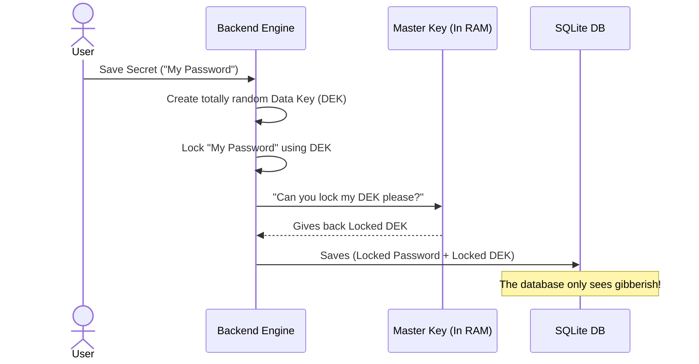
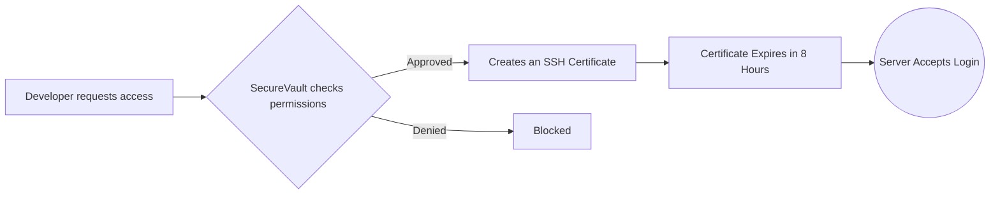

# SecureVault Project Report.       Created by Sandesha Wakchaure

## 1. Project Overview

**What is SecureVault?**
SecureVault is a high-security vault that you own and host yourself. It acts as a highly secure digital safe for your organization's most sensitive information. Instead of trusting a third-party company with your passwords and infrastructure keys, SecureVault lets you manage them internally with bank-grade security.

It does four main things:
1. **Stores Secrets Safely:** Encrypts API keys, passwords, and tokens so nobody (not even a database admin) can read them without the master password.
2. **Manages SSH Access:** Replaces permanent server SSH keys with temporary, expiring "certificates" (like a temporary visitor badge).
3. **Autopilot Passwords:** Logs into your remote databases (like Postgres or Redis) and automatically changes their passwords on a schedule.
4. **Keeps a Record:** Tracks exactly who did what, and when.

---

## 2. How Everything Connects (Architecture)

SecureVault is split into three main pieces running inside Docker containers:

```mermaid
graph TD
    User([User / Web Browser])
    Nginx[Nginx Web Server\n(HTTPS :443)]
    
    subgraph "Docker Subnet"
        Frontend[React Frontend UI\n(TypeScript)]
        Backend[FastAPI Backend\n(Python 3.11)]
        DB[(SQLite Database\nEncrypted Data)]
        CA((SSH Certificate Authority\nKey Storage))
    end

    User -->|Visits Page| Nginx
    Nginx -->|Serves Visuals| Frontend
    Nginx -->|API Route| Backend
    Frontend -->|Talks to| Backend
    Backend -->|Saves secrets to| DB
    Backend -->|Signs temporary keys| CA
```

---

## 3. How the Security Actually Works

### The Envelope Encryption Concept
SecureVault uses an advanced technique called "Envelope Encryption" to ensure your data is safe even if someone steals the physical database files.

1. The system creates a master key when it first starts up (derived from the `.env` file). **This master key is never saved to the hard drive; it only lives in RAM.**
2. When you save a secret, the system creates a brand new, random "mini-key" specific to that secret.
3. It uses the master key to lock the mini-key, and the mini-key to lock your secret. 



### SSH Certificate Authority (The Visitor Badge System)
Instead of giving developers a permanent SSH key that they might lose, SecureVault acts as a bouncer.



---

## 4. What We Fixed to Make it Production-Ready

When we built the final version, a few things broke because Python and React modules changed over time. Here is the simple breakdown of what we repaired:

### 🐍 Backend (Python) Fixes
* **The Redis Crash:** The backend was using an older tool (`aioredis`) that stopped working entirely on modern Python 3.11. 
  * *Fix:* We ripped it out and upgraded to the native `redis.asyncio` driver.
* **The Database Crash:** The `motor` tool was trying to use a feature inside MongoDB that MongoDB recently deleted in version 4.9. 
  * *Fix:* We downgraded the MongoDB library to a stable version (`4.6.3`) so the backend could boot successfully.
* **The Ghost Import:** A file was trying to import a security checker (`ssh_ca.validator`) that didn't exist anymore. 
  * *Fix:* We deleted the broken import and pointed the system to use a built-in function instead.

### ⚛️ Frontend (React) Fixes
* **The "Rules of Hooks" Violation:** React has strict rules about how you render elements on the screen. The Two-Factor Authentication (TOTP) screen was breaking these rules by creating dynamic references inside a loop.
  * *Fix:* We unified the references into a single array block, making React happy and allowing it to compile.
* **String Parsing Errors:** The dashboard tries to display Bash scripts to the user to copy-paste. React became confused by standard quotes in those bash scripts.
  * *Fix:* We locked those scripts inside ES6 template literals (`` ` ``) so React treats them securely as plain text.

---


